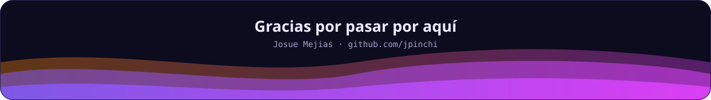

<!-- ═══════════════════════════ HÉROE ═══════════════════════════ -->

<picture>
  <source media="(max-width: 600px)" srcset="https://raw.githubusercontent.com/jpinchi/jpinchi/main/assets/profile/hero-m.svg" />
  
</picture>

<!-- ═══════════════════════════ 01 · SOBRE MÍ ═══════════════════════════ -->
<picture>
  <source media="(max-width: 600px)" srcset="https://raw.githubusercontent.com/jpinchi/jpinchi/main/assets/profile/h-sobre-mi-m.svg" />
  
</picture>

Construyo **software que la gente usa a diario**: apps de escritorio para Windows, paneles web que se actualizan en vivo y apps con inteligencia artificial.

Me gusta que las cosas sean **rápidas, bonitas y privadas**, así que muchos de mis proyectos funcionan **100% offline**: sin cuentas, sin servidores y sin suscripciones.

- 🖨️ Monitoreo **flotas de impresoras** por SNMP con un panel en tiempo real
- 📄 Hice **Pliego**, un editor de PDF de escritorio completo
- 📝 Mantengo **Noty**, una app de notas con diseño de cristal (+30 versiones)
- 🧠 Lancé **EnglishMind**, un tutor de inglés con IA que ya está en producción
- 🕵️ Creé **Agent File**, una app iOS con casos generados por **Claude AI**
- 🌎 Mis apps hablan **español e inglés**

<picture>
  <source media="(max-width: 600px)" srcset="https://raw.githubusercontent.com/jpinchi/jpinchi/main/assets/profile/about-code-m.svg" />
  
</picture>

<!-- ═══════════════════════════ 02 · TECNOLOGÍAS ═══════════════════════════ -->
<picture>
  <source media="(max-width: 600px)" srcset="https://raw.githubusercontent.com/jpinchi/jpinchi/main/assets/profile/h-tecnologias-m.svg" />
  
</picture>

<picture>
  <source media="(max-width: 600px)" srcset="https://raw.githubusercontent.com/jpinchi/jpinchi/main/assets/profile/tech-m.svg" />
  
</picture>

<!-- ═══════════════════════════ 03 · PROYECTOS ═══════════════════════════ -->
<picture>
  <source media="(max-width: 600px)" srcset="https://raw.githubusercontent.com/jpinchi/jpinchi/main/assets/profile/h-proyectos-m.svg" />
  
</picture>

<table>
<tr>
<td width="50%" valign="top">

###  Printer Device Manager

Descubre por **SNMP** todas las impresoras de tu red y muestra en un panel **en vivo** su estado, el tóner por color, los contadores y las alertas. Soporta varias sedes, reportes en PDF/Excel/CSV y tiene app de escritorio.

</td>
<td width="50%" valign="top">

###  Pliego

Un **editor de PDF** de escritorio para Windows: anota, firma, rellena formularios, tapa datos sensibles, añade marcas de agua y organiza páginas. **Sin servidores, sin suscripción y 100% offline.**

</td>
</tr>
<tr>
<td width="50%" valign="top">

###  Noty

App de notas para Windows con **diseño de cristal** y 5 estilos. Notas rápidas desde cualquier programa con <kbd>Ctrl</kbd> + <kbd>Shift</kbd> + <kbd>Espacio</kbd>, tareas, recordatorios, calculadora integrada y notas cifradas con **AES-256**.

</td>
<td width="50%" valign="top">

### 🕵️ Agent File

App **iOS** para prepararse para una carrera en el **FBI**: cada día genera una **investigación nueva con IA**, e incluye casos federales reales, práctica para entrevistas y una bolsa de empleo federal en vivo.

</td>
</tr>
<tr>
<td width="50%" valign="top">

###  EnglishMind

Tutor de inglés con IA para hispanohablantes, ya **en producción**: ejercicios generados por IA, reto mensual, lectura, chat con tutor, práctica de **pronunciación** y notificaciones para no perder tu **racha**. Es una PWA que se instala en el teléfono.

</td>
<td width="50%" align="center" valign="middle">

### 🔭 ¿Quieres ver más?

Todos mis proyectos públicos están en mis repositorios.

</td>
</tr>
</table>

<!-- ═══════════════════════════ 04 · ESTADÍSTICAS ═══════════════════════════ -->
<picture>
  <source media="(max-width: 600px)" srcset="https://raw.githubusercontent.com/jpinchi/jpinchi/main/assets/profile/h-estadisticas-m.svg" />
  
</picture>

<picture>
  <source media="(max-width: 600px)" srcset="https://raw.githubusercontent.com/jpinchi/jpinchi/output/stats-mobile.svg" />
  
</picture>

<!-- ═══════════════════════════ 05 · CONTRIBUCIONES ANIMADAS ═══════════════════════════ -->
<picture>
  <source media="(max-width: 600px)" srcset="https://raw.githubusercontent.com/jpinchi/jpinchi/main/assets/profile/h-contribuciones-m.svg" />
  
</picture>

<b>Calendario 3D</b> — cada bloque es un día y crece según cuánto programé

  

<b>Pac-Man</b> — se come mis contribuciones mientras lo persiguen los fantasmas

  

<b>Space Shooter</b> — una nave dispara y destruye mis contribuciones

  

<b>Bomberman</b> — pone bombas que hacen explotar mis contribuciones mientras lo persigue un enemigo

<!-- ═══════════════════════════ 06 · HABLEMOS ═══════════════════════════ -->
<picture>
  <source media="(max-width: 600px)" srcset="https://raw.githubusercontent.com/jpinchi/jpinchi/main/assets/profile/h-hablemos-m.svg" />
  
</picture>

<a href="mailto:josueldinhoo@gmail.com"><picture>
  <source media="(max-width: 600px)" srcset="https://raw.githubusercontent.com/jpinchi/jpinchi/main/assets/profile/contact-m.svg" />
  
</picture></a>

<!-- ═══════════════════════════ PIE ═══════════════════════════ -->
<picture>
  <source media="(max-width: 600px)" srcset="https://raw.githubusercontent.com/jpinchi/jpinchi/main/assets/profile/footer-m.svg" />
  
</picture>
